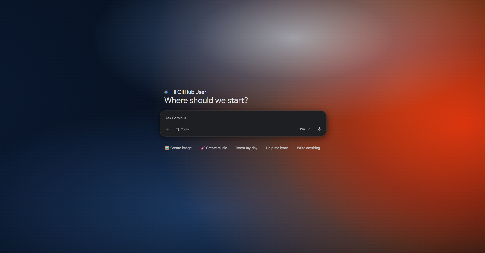

# Gemini UI Theme

A minimalist browser theme replicating the signature Gemini gradient aesthetic for a cohesive, modern workspace.

---

### 🛠 Installation

To load the extension manually in your browser:

1. **Prepare Files:** Download and unzip the theme folder to your local drive.
2. **Open Extensions:** Navigate to your browser's extension settings (usually found under **Extensions** > **Manage Extensions**).
3. **Developer Mode:** Ensure **Developer mode** is toggled **ON** in the top right corner.
4. **Load Unpacked:** Click the **Load unpacked** button located in the top left corner.
5. **Select Folder:** Browse to and select the unzipped folder to apply the theme.

---

### 📸 Preview

